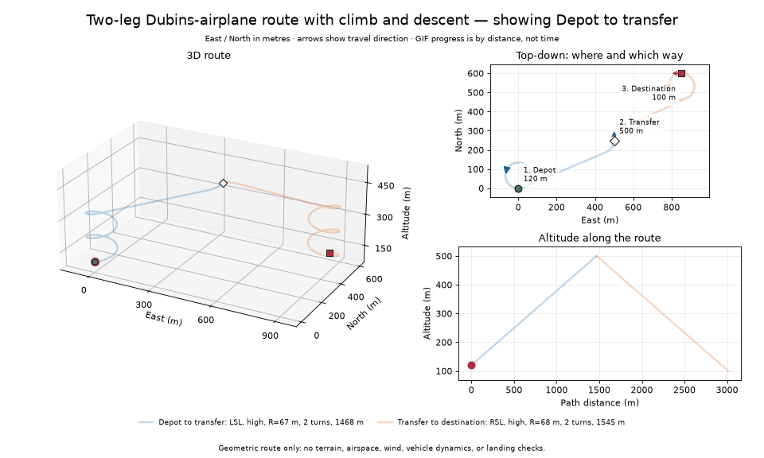

# 3D Dubins for aerial logistics

A small Python Dubins-airplane planner: give it a start and destination position, required headings, a minimum turn radius, and a maximum climb angle. It returns a flyable geometric route leg. The core needs no third-party packages.



## Run

From this folder:

```bash
python -m examples.example
python -m unittest discover -s tests -v
```

For plots and GIF generation:

```bash
python -m pip install -r requirements.txt
python -m examples.example --plot
python -m examples.example --save-visuals
```

The examples write CSV routes to `outputs/`. Saved PNGs and GIFs are in `visuals/`.

## Use it in Python

```python
from math import radians
from dubins_airplane import Pose, plan_dubins_airplane

start = Pose(0, 0, 120, radians(0))
goal = Pose(500, 250, 500, radians(90))
path = plan_dubins_airplane(start, goal, 60, radians(15))
print(path.word, path.extra_turns, path.length)
points = path.sample(5)
```

`x` is east, `y` north, `z` upward (metres); yaw is in radians from east. `L`, `R`, and `S` mean left turn, right turn, and straight. Large altitude changes add full helical turns.

## Explore

- [`example.py`](examples/example.py): climb to a high transfer point, then descend.
- [`example_arrival_heading.py`](examples/example_arrival_heading.py): same destination, different arrival headings.
- [`example_climb_limit.py`](examples/example_climb_limit.py): how climb angle determines helix turns.
- [`example_delivery_mission.py`](examples/example_delivery_mission.py): several preset delivery-area waypoints.
- [Visual guide](docs/VISUAL_GUIDE.md), [method and paper guide](docs/KNOWLEDGE_GUIDE.md), [paper sources](papers/README.md), and [other implementations](docs/IMPLEMENTATIONS.md).

This is **not** a shortest-possible 3D path or a flight-ready planner. It does not check obstacles, airspace, wind, landing, or vehicle-specific dynamics. The locally downloaded PDFs stay in `papers/` but are Git-ignored until redistribution rights are checked.
