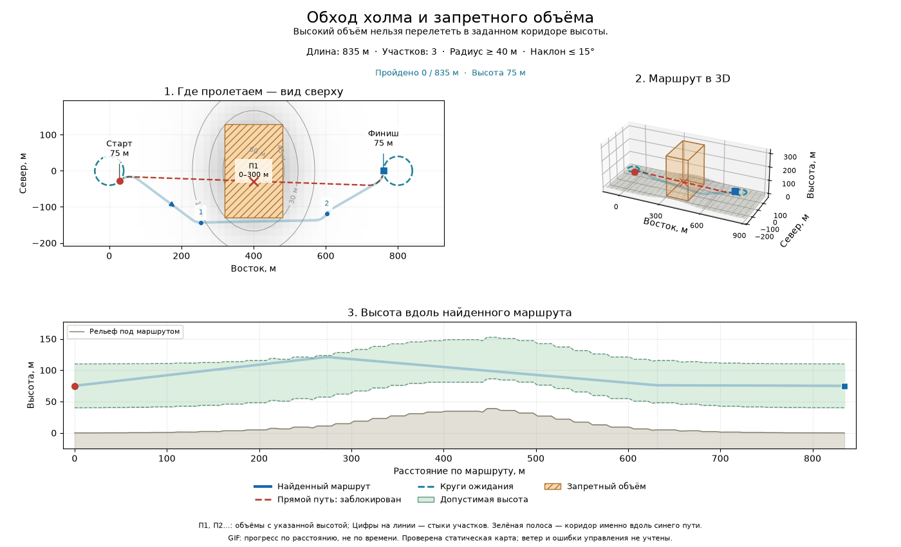

# Visual guide to the examples

The pictures show the same route in three ways. The **3D view** shows the actual shape; the **top-down view** shows where the aircraft flies and its travel direction; the **altitude profile** shows how high it is after a given distance along the path. Coordinates are local metres: `x` is east, `y` is north, and `z` is altitude upward. `yaw=0°` means east, `90°` north, and `180°` west.

The green circle is the first waypoint, a red square is the last, and white diamonds are intermediate waypoints. Numbered labels tell you the requested location and altitude. Each colored curve is one route leg. The small arrows point in the travel direction, including the requested heading at the end of a leg. GIFs move in equal **distance** increments, not equal time increments: this planner does not model speed.

Read each path code from start to finish: `L` is a left turn, `R` a right turn, and `S` a straight segment in the horizontal plane. For example, `RSR` means right turn → straight → right turn. Low/high cases have three letters; the medium case has four, because it adds an intermediate arc. The legend gives the altitude case, actual turn radius, number of added complete turns, and total **3D** length. High-case turns extend the first helix for climb or the last helix for descent. Height changes uniformly with path distance within every leg, including the straight section.

For nearly level routes, the 3D panel expands the vertical display scale to keep it legible. Its altitude labels and the altitude profile retain the real metre values.

## 1. Two-leg route: depot → high transfer point → destination

The aircraft begins at the depot at 120 m heading east, climbs to the transfer point at 500 m heading north, then descends to the destination at 100 m heading west. The maximum climb/descent angle is 15° and the minimum horizontal turn radius is 60 m. Both legs are high-altitude cases: each adds two complete turns and fits a radius slightly above 60 m to achieve exactly the required height change at 15°.


[Open a still image](../visuals/two_leg_route.png) · Code: [`example.py`](../examples/example.py)

## 2. Same destination, different arrival direction

Both alternatives leave the same depot and reach `(450, 250, 120)`. One must arrive facing east and the other facing west. The west-facing route is longer because the aircraft cannot turn in place: it must obey the 60 m minimum turn radius. Both stay level, so their altitude profiles are flat.


[Open a still image](../visuals/arrival_headings.png) · Code: [`example_arrival_heading.py`](../examples/example_arrival_heading.py)

## 3. Owen's three altitude cases

All three alternatives start at `(0, 0, 100)` heading east and reach `(500, 200)` heading north, but their target heights differ. The minimum radius is 50 m and the limiting angle is 12°. **Low** uses the ordinary CSC with a shallower climb. **Medium** adds a fitted partial maneuver without a complete extra loop. **High** adds two complete loops and increases the radius. Medium/high use the limiting climb angle; their altitude-profile slopes are identical. The GIF visits the alternatives one after another; they are not consecutive legs of one mission.


[Open a still image](../visuals/climb_helix.png) · Code: [`example_climb_limit.py`](../examples/example_climb_limit.py)

## 4. A three-leg delivery-area route

The waypoints are fixed in advance: Depot → Customer A → Customer B → Return corridor. Each leg connects a requested position **and heading**. The total distance printed by the script is the sum of the three flyable leg lengths, not the straight-line distance between stops. These are fly-through positions, not modeled landings or payload releases.


[Open a still image](../visuals/delivery_mission.png) · Code: [`example_delivery_mission.py`](../examples/example_delivery_mission.py)

## 5. Terrain, obstacle and safe arrival circle

[`example_obstacles.py`](../examples/example_obstacles.py) has no prescribed intermediate waypoints. It uses a different, simpler layout with Russian labels. Read it in this order:

1. **Top-left map:** green point = departure; blue square = arrival. The **one blue line** is the entire discovered route. Teal dashed circles are safe loiters, not extra route legs. Small blue numbers mark the joins between RRT* legs.
2. **Top-right 3D view:** the same route and heights, with transparent terrain/boxes so the line remains visible. Height may be visually expanded; use the labelled metre values, not the display aspect ratio.
3. **Bottom height profile:** distance along the **blue route**, not east coordinate. The route must stay between the two dashed green bounds. Green fill is the permitted corridor; grey-brown ground is the terrain beneath this route. Its raster steps are expected. This band uses conservative Euclidean offsets, not simply terrain height plus a constant vertical clearance.

Orange hatched footprints are forbidden **volumes**, labeled `П1`, `П2`, etc., with their altitude ranges. The direct Dubins comparison uses exactly the found route's departure and arrival states. It is **red dashed if blocked**, with a cross at a blocked sample, or **grey dashed if free**. The altitude panel shows the corridor of the found route, not of that comparison. The continuous checker decides safety; crosses are only point-sampled visual explanations and do not locate every possible collision.

The GIF's red moving marker is synchronized across map, 3D, and altitude profile; the darker blue trail shows distance already covered. It does **not** show a physical speed or flight time. The aircraft arrives tangent to the goal circle and can continue circling there.



[Open a still image](../visuals/obstacle_route.png) · Code: [`example_obstacles.py`](../examples/example_obstacles.py)

## 6–8. Three more terrain-planning scenarios

All use the same script and the same visual conventions. Default seed is 7, turn radius at least 40 m, and climb/descent limit 15°. The maps are synthetic, not real flight areas.

| Scenario | What to look for | Preview |
| --- | --- | --- |
| `buildings` | Three forbidden boxes on flat ground. The route goes around them laterally; almost level altitude separates this from a terrain problem. | [PNG](../visuals/obstacle_buildings.png), [GIF](../visuals/obstacle_buildings.gif) |
| `ridge` | No boxes: the red direct path violates clearance near the high ridge. The blue path goes around its lower flank and stays in the local height corridor. | [PNG](../visuals/obstacle_ridge.png), [GIF](../visuals/obstacle_ridge.gif) |
| `climb` | Start is about 78 m, goal about 191 m. The permitted corridor rises over the slope. The grey direct connection is **free** and coincides with the blue route; not every scene requires a detour. | [PNG](../visuals/obstacle_climb.png), [GIF](../visuals/obstacle_climb.gif) |

```bash
python -m examples.example_obstacles --scenario buildings --plot
python -m examples.example_obstacles --scenario ridge --plot
python -m examples.example_obstacles --scenario climb --plot
```

## Run and regenerate

From the `3dDubins` directory:

```bash
python -m pip install -r requirements.txt
python -m examples.example --plot
python -m examples.example_climb_limit --plot
python -m examples.example_arrival_heading --plot
python -m examples.example_delivery_mission --plot
python -m examples.example_obstacles --plot
python -m examples.example_obstacles --scenario all --save-visuals
```

Use `--save-visuals` in place of `--plot` to write or update that script's PNG and GIF in `visuals/`. The normal no-flag examples still run without plotting packages. GIF creation uses Matplotlib's Pillow writer; no FFmpeg is needed.

Examples 1–4 are obstacle-unaware geometric illustrations. Examples 5–8 check their supplied raster terrain bands and any box obstacles, but do not account for wind, tracking errors, dynamic obstacles, takeoff/landing or payload handling. No real-flight safety guarantee is implied. The meaning and limits of the models are in [`KNOWLEDGE_GUIDE.md`](KNOWLEDGE_GUIDE.md).
