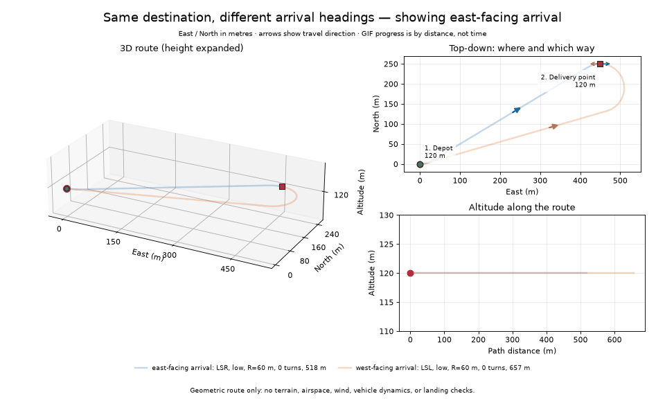
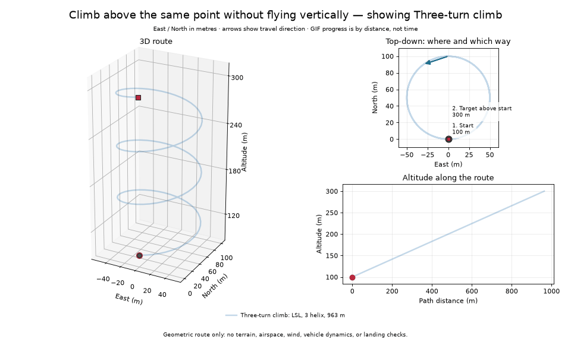
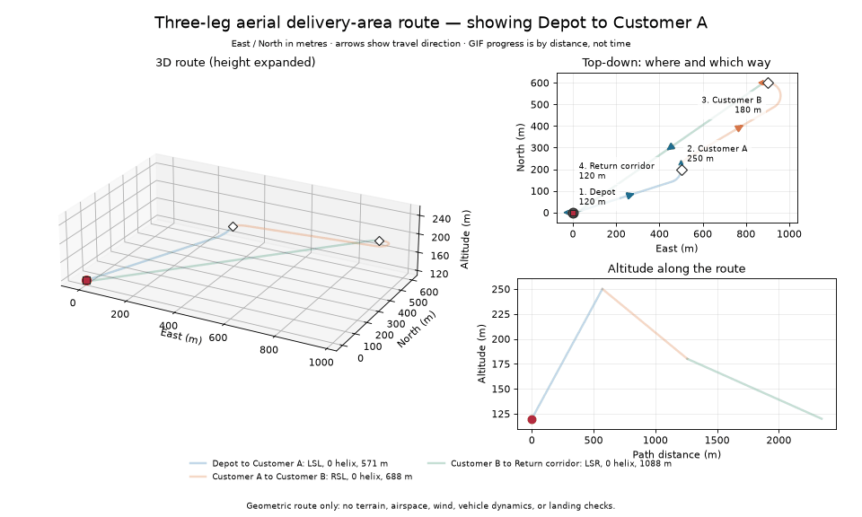

# Visual guide to the examples

The pictures show the same route in three ways. The **3D view** shows the actual shape; the **top-down view** shows where the aircraft flies and its travel direction; the **altitude profile** shows how high it is after a given distance along the path. Coordinates are local metres: `x` is east, `y` is north, and `z` is altitude upward. `yaw=0°` means east, `90°` north, and `180°` west.

The green circle is the first waypoint, a red square is the last, and white diamonds are intermediate waypoints. Numbered labels tell you the requested location and altitude. Each colored curve is one route leg. The small arrows point in the travel direction, including the requested heading at the end of a leg. GIFs move in equal **distance** increments, not equal time increments: this planner does not model speed.

Read each path code from start to finish: `L` is a left turn, `R` a right turn, and `S` a straight segment in the horizontal plane. For example, `RSR` means right turn → straight → right turn. Low/high cases have three letters; the medium case has four, because it adds an intermediate arc. The legend gives the altitude case, actual turn radius, number of added complete turns, and total **3D** length. High-case turns extend the first helix for climb or the last helix for descent. Height changes uniformly with path distance within every leg, including the straight section.

For nearly level routes, the 3D panel expands the vertical display scale to keep it legible. Its altitude labels and the altitude profile retain the real metre values.

## 1. Two-leg route: depot → high transfer point → destination

The aircraft begins at the depot at 120 m heading east, climbs to the transfer point at 500 m heading north, then descends to the destination at 100 m heading west. The maximum climb/descent angle is 15° and the minimum horizontal turn radius is 60 m. Both legs are high-altitude cases: each adds two complete turns and fits a radius slightly above 60 m to achieve exactly the required height change at 15°.


[Open a still image](../visuals/two_leg_route.png) · Code: [`example.py`](../examples/example.py)

## 2. Same destination, different arrival direction

Both alternatives leave the same depot and reach `(450, 250, 120)`. One must arrive facing east and the other facing west. The west-facing route is longer because the aircraft cannot turn in place: it must obey the 60 m minimum turn radius. Both stay level, so their altitude profiles are flat.



[Open a still image](../visuals/arrival_headings.png) · Code: [`example_arrival_heading.py`](../examples/example_arrival_heading.py)

## 3. Owen's three altitude cases

All three alternatives start at `(0, 0, 100)` heading east and reach `(500, 200)` heading north, but their target heights differ. The minimum radius is 50 m and the limiting angle is 12°. **Low** uses the ordinary CSC with a shallower climb. **Medium** adds a fitted partial maneuver without a complete extra loop. **High** adds two complete loops and increases the radius. Medium/high use the limiting climb angle; their altitude-profile slopes are identical. The GIF visits the alternatives one after another; they are not consecutive legs of one mission.



[Open a still image](../visuals/climb_helix.png) · Code: [`example_climb_limit.py`](../examples/example_climb_limit.py)

## 4. A three-leg delivery-area route

The waypoints are fixed in advance: Depot → Customer A → Customer B → Return corridor. Each leg connects a requested position **and heading**. The total distance printed by the script is the sum of the three flyable leg lengths, not the straight-line distance between stops. These are fly-through positions, not modeled landings or payload releases.



[Open a still image](../visuals/delivery_mission.png) · Code: [`example_delivery_mission.py`](../examples/example_delivery_mission.py)

## Run and regenerate

From the `3dDubins` directory:

```bash
python -m pip install -r requirements.txt
python -m examples.example --plot
python -m examples.example_climb_limit --plot
python -m examples.example_arrival_heading --plot
python -m examples.example_delivery_mission --plot
```

Use `--save-visuals` in place of `--plot` to write or update that script's PNG and GIF in `visuals/`. The normal no-flag examples still run without plotting packages. GIF creation uses Matplotlib's Pillow writer; no FFmpeg is needed.

These are geometric illustrations only. They do not check terrain, obstacles, airspace, wind, takeoff/landing, or payload handling. The meaning and limits of the model are in [`KNOWLEDGE_GUIDE.md`](KNOWLEDGE_GUIDE.md).
